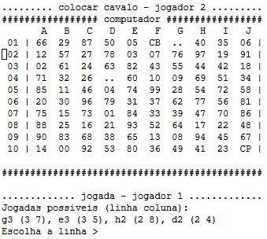

# **Manual de Utilizador**

## Inteligência Artificial | Projeto 2 - Jogo do Cavalo (2 jogadores) | André Meseiro 202100225 e Pedro Anjos 202100230

### 1. Objetivos do programa e descrição geral do seu funcionamento

O objetivo do programa é resolver o "Jogo do Cavalo" para 2 jogadores, que decorre num tabuleiro 10x10, em que cada casa contém valores (pontuações) entre 00 e 99, sem repetição, distribuídos de forma aleatória cada vez que se inicia um novo jogo.

As regras de funcionamento adotadas para este problema específico são as seguintes:

* Existem dois jogadores, o jogador 1 joga com o cavalo branco e o jogador 2 joga com o cavalo preto;

* O jogo tem início com a colocação do cavalo branco na casa de maior pontuação da 1ª linha do tabuleiro (A1-J1);

* Quando o jogador efetua uma jogada, o valor da casa de onde o jogador saiu é apagado, e a casa torna-se inacessível para o resto do jogo;

* Se a casa escolhida tiver um número com dois dígitos diferentes, por exemplo 24, o seu número simétrico, neste caso 42, é apagado do tabuleiro, ficando a respetiva casa inacessível durante o resto do jogo, não podendo terminar outra jogada na mesma;

* Se o cavalo for colocado numa casa com um número "duplo", por exemplo 33, o jogador pode remover qualquer outro número duplo do tabuleiro, à sua escolha (por *default* remove-se a de maior valor);

* Após a primeira jogada (colocar o cavalo branco) segue-se a jogada do adversário, com a colocação do cavalo preto na casa de maior pontuação da 10ª linha do tabuleiro (A10-J10);

* Após a primeira jogada do jogador 2, aplicam-se as mesmas regras do número simétrico e duplo, descritas acima;

* Seguidas as primeiras jogadas de cada um dos jogadores, as jogadas seguintes são efetuadas através de um movimento de cavalo, usando as regras tradicionais do Xadrez para o cavalo. Um cavalo não pode saltar para uma casa vazia (sem número) e também não pode fazê-lo para uma casa que esteja ameaçada pelo cavalo adversário;

* A cada jogada de um jogador repete-se a regra do simétrico ou duplo;

* Cada vez que uma casa é visitada, o valor da mesma é somado à pontuação do jogador; a remoção de simétricos e "duplos" não tem pontuação associada;

* Caso um dos jogadores não consiga movimentar o seu cavalo, cede a vez ao jogador oposto;

* O jogo termina quando nenhum dos jogadores conseguir movimentar o seu cavalo e o vencedor consiste no jogador que tiver maior pontuação entre os dois.

### 2. Utilização do programa (com exemplos)

* Inicialização do programa - Executando a função 'iniciar'

    

* humano VS computador - Introduzindo '1'

    

* Seleção de quem começa a jogar - Introduzindo '1' (humano) ou '2' (computador)

    

* Escolha do tempo limite para o computador efetuar a sua jogada - Introduzindo um valor no intervalo [1000, 5000] (ms)

    

    

    

* Jogada do primeiro jogador (neste caso, o humano) e respetiva jogada do computador - Introduzindo 'valor da linha' e 'valor da coluna'

  * P.S: As jogadas depois são sempre feitas da mesma forma, introduzindo os valores das jogadas possíveis e sendo feita a jogada do computador

    

    

* Fim do jogo humano VS computador

  

* Voltar ao menu principal, após o fim do jogo - Introduzindo '1'

  

* computador VS computador - Introduzindo '2'

  

  * Existe outra vez a escolha do tempo limite para os computadores fazerem a sua jogada, tal como na imagem acima

  * Após fazer essa escolha, começam a ser feitas jogadas pelos dois computadores, até chegar ao final do jogo, sendo observado o mesmo que foi observado nas imagens acima

* Fim do jogo computador VS computador

  

  

  * Também é possível, tal como observado anteriormente, voltar ao menu principal após o fim do jogo, introduzindo - '1'

* Sair do programa - Introduzindo '0'
  
  

### 3. Informação necessária e produzida - *Input* e *Output* (ecrã/teclado e ficheiros)

* Input

  * É necessário chamar a função 'iniciar', para iniciar o programa, fazendo (5::iniciar);

  * É necessário introduzir caracteres numéricos para selecionar as opções do menu, por exemplo, '0' para voltar atrás/não e '1' para selecionar a primeira opção/sim;

  * É necessário introduzir um valor numérico no intervalo [1000, 5000] (ms) para escolher o tempo limite para o computador efetuar a sua jogada;

  * É necessário, no caso de ser um jogador humano a jogar, introduzir os valores das linhas e colunas das jogadas a efetuar;

* Output

  * Menu inicial no ecrã, após chamar a função 'iniciar';

  * Tabuleiro aleatório gerado para o início do jogo, após ter sido escolhido o tipo de jogo (humano VS computador ou computador VS computador) e quem faz a primeira jogada;

  * Jogadas possíveis de efetuar (se for um jogador humano);

  * Tabuleiro resultado das jogadas efetuadas;

  * Tabuleiro de fim do jogo e respetivo vencedor conjuntamente com as pontuações de cada jogador;

  * Os resultados do jogo atual são escritos para um ficheiro log.dat, sendo o mesmo ficheiro reescrito quando se inicia um novo jogo.

### 4. Limitações do programa (do ponto de vista do utilizador)

As limitações que podem ser encontradas no programa, de natureza não técnica, são a interface não ser a mais apelativa, e o facto do programa funcionar apenas após chamar a função 'iniciar' e posteriormente com a introdução de caracteres, em vez de existir uma interface "clicável" e mais apelativa visualmente. Existe também a possibilidade de melhorar a "escrita" da interface, por exemplo, na parte do jogador escolher a linha e coluna para efetuar a jogada - a forma como é apresentada ao utilizador para fazer a escolha poderia ser mais intuitiva.
